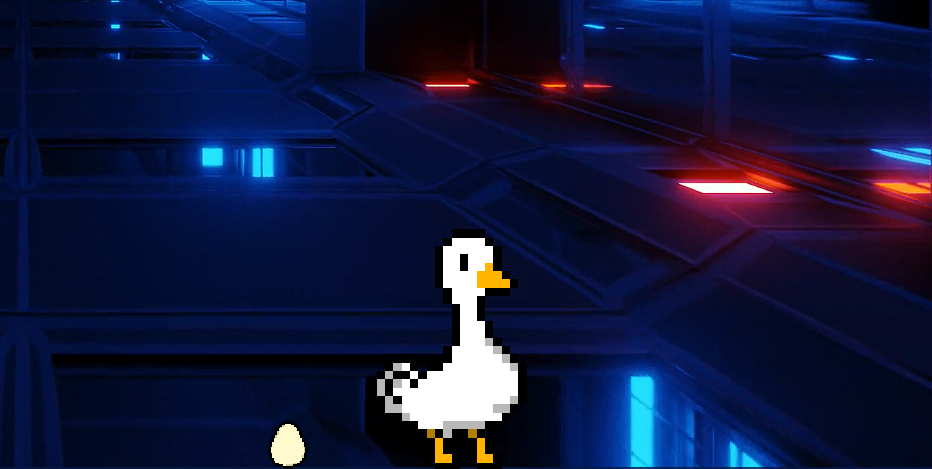

# py-goose

py-goose is a python script that makes a goose appear on your desktop!

## Installation
To install every package needed to run this script, type this in your console:

```bash
pip install -r requirements.txt
```

## Usage

To run this script, use:

```bash
python3 __main__.py
```
in a console window.

## Images
<div align="center">

<p><i>Josiane the Goose walking on my desktop</i></p>


<p><i>Josiane the Goose laying eggs</i></p>
</div>


## Tweaks

You can decide if you want the Goose to lay eggs by changing this line in the `__main__.py` file:
```python
SPAWN_EGGS = True  # True if you want the Goose to lay eggs, False otherwise. 
```

## License
- romainflcht